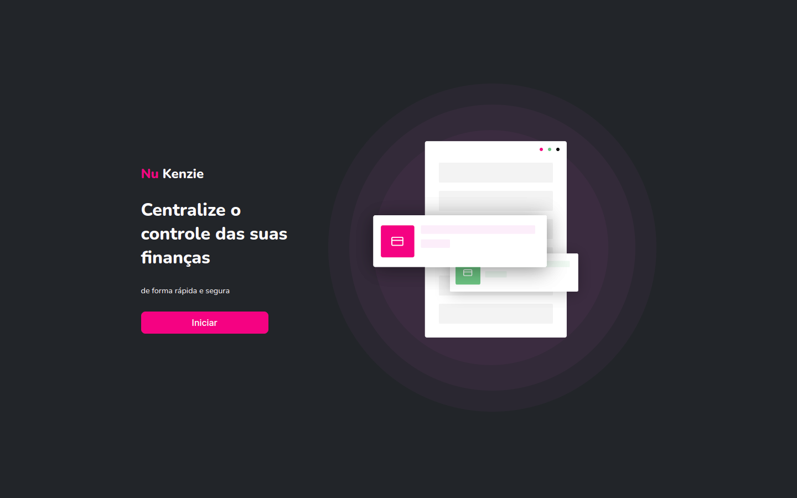
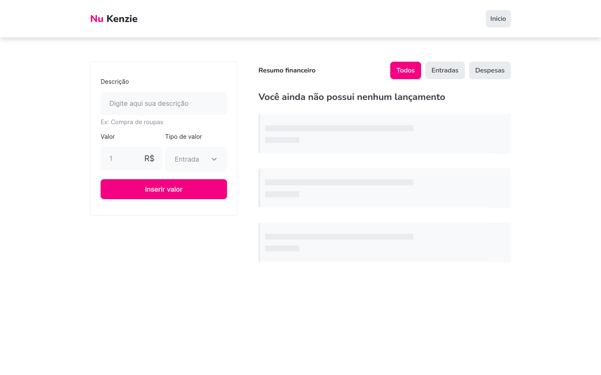

<h1 align="center">Nu Kenzie</h1>

 

## Sobre o Projeto.

 Nu Kenzie é uma aplicação para gerenciamento de gastos, cadastrando entradas e saídas.

## Tecnologias usadas

 Link para a aplicação: <a href='https://www.google.com/'>Nu Kenzie</a>.

 

## Layout web:

 

 
